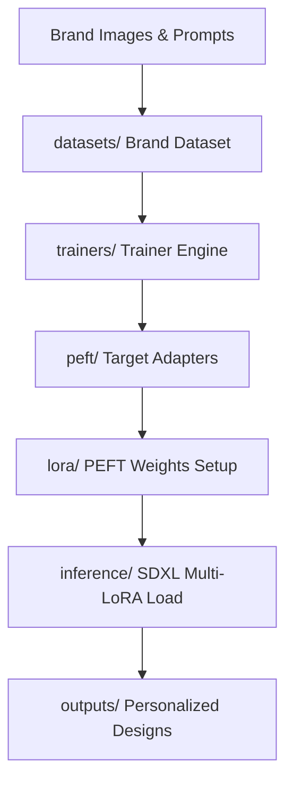

# Week 4: Brand Style Personalization via LoRA Fine-Tuning

Welcome to the **Week 4 Brand Style Personalization** module of the AI-Powered Fashion Design Assistant. 

This module establishes the folder layouts, configurations, logging systems, and environment foundations required to fine-tune Stable Diffusion XL (SDXL) models on bespoke brand archives (e.g., retro luxury, technical streetwear) using Low-Rank Adaptations (LoRA).

---

## 🏗️ Architecture & Component Layout

The directory structure is organized following enterprise-grade clean design practices:

```
week4/
├── configs/
│   ├── __init__.py
│   └── config_manager.py     # Pydantic Configuration Management system
├── datasets/
│   └── __init__.py           # Brand-specific image & prompt dataset loaders
├── docs/
│   └── setup_guide.md        # Environment setup and acceleration guide
├── evaluation/
│   └── __init__.py           # Identity preservation & style similarity metrics
├── inference/
│   └── __init__.py           # Multi-LoRA loading and scaling inference engines
├── lora/
│   └── __init__.py           # PEFT target modules maps and adapter helpers
├── trainers/
│   └── __init__.py           # LoRA PEFT adapters training loops
├── style_manager/
│   └── __init__.py           # Registry mapping styles to LoRA safetensors paths
├── outputs/                  # Fine-tuned weights, logs, and visual samples
├── logs/                     # Rotation General, Error, and Trainer logs
├── tests/
│   ├── __init__.py
│   ├── test_configs.py       # Configuration parser unit tests
│   └── test_logging.py       # Rotated Loguru sink unit tests
├── __init__.py
├── logging_setup.py          # Loguru multi-sink initialization framework
└── requirements.txt          # LoRA and PEFT requirements manifest
```

---

## ⚙️ Core Infrastructures

### 1. Configuration System (`week4/configs/config_manager.py`)
Our configuration system leverages **Pydantic V2** to enforce type-safety, default bounds, and configuration nesting. It defines:
- **`LoraConfig`**: Specifies rank ($r$), alpha ($\alpha$), target modules (e.g., attention blocks `to_q`, `to_k`, `to_v`), learning rate, and dropdown settings.
- **`DatasetConfig`**: Directs image/text manifests, resolution constraints (e.g., $1024 \times 1024$), and train/val splits.
- **`TrainerConfig`**: Governs training steps, batch sizes, gradient accumulation, mixed precision, and checkpointing intervals.
- **`InferenceConfig`**: Maps base model parameters, default prompts, scale weights, and negative triggers.
- **`Week4Config`**: A centralized configuration object supporting YAML/JSON serialization.

### 2. Logging Framework (`week4/logging_setup.py`)
Utilizes **Loguru** to coordinate three independent file-rotated log sinks:
- **General Log (`logs/week4_general.log`)**: Daily rotated general log capturing debugging traces.
- **Error Log (`logs/errors.log`)**: Rotary sink capturing system-wide errors and traceback diagnostics (level `ERROR`).
- **Trainer Log (`logs/lora_trainer.log`)**: Targeted file filter capturing training loss updates and epoch progress.

### 3. Setup Guide (`week4/docs/setup_guide.md`)
Step-by-step documentation detailing dependency installations, virtual environment setups, and HuggingFace `accelerate` configurations.

---

## 🚀 Workflow Blueprint (Fine-Tuning Loop)



1. **Dataset Loading**: Reads paired brand designs and metadata, applying aspect-ratio bucketed crops.
2. **LoRA Injection**: Locks SDXL base parameters, injecting trainable rank adapters into self-attention and cross-attention blocks.
3. **PEFT Optimization**: Minimizes loss function via AdamW, saving trained adapters in Safetensors format.
4. **Style Registry mapping**: Links custom brand tokens to saved adapters, enabling prompt-driven activation.
