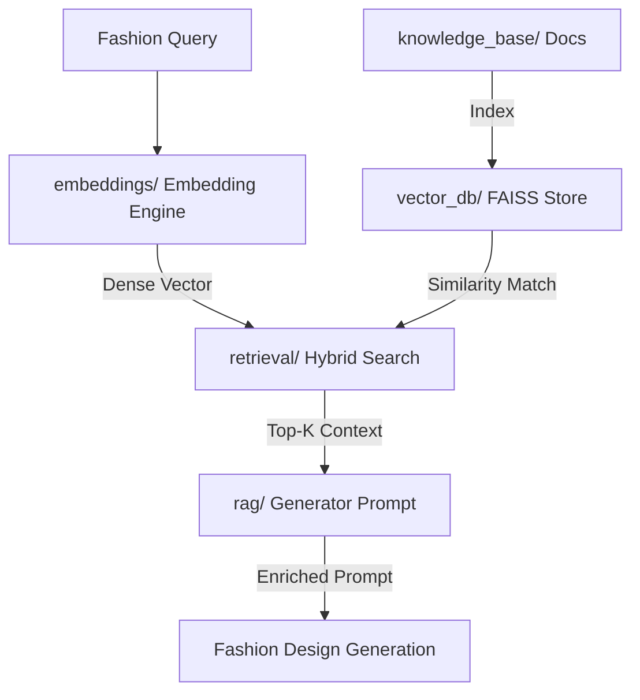

# Week 5: Fashion Intelligence & Retrieval-Augmented Generation (RAG) System

This module establishes the folder layouts, configurations, logging systems, and environment foundations required to build a complete **Fashion Intelligence and Retrieval-Augmented Generation (RAG) System**.

---

## 🏗️ Architecture & Component Layout

The directory structure is organized as follows:

```
week5/
├── configs/
│   ├── __init__.py
│   └── config_manager.py     # Pydantic Configuration Management system
├── docs/
│   └── setup_guide.md        # Environment setup and Vector DB/Transformers guide
├── embeddings/
│   └── __init__.py           # Embedding models wrappers and vectors generation
├── knowledge_base/
│   └── __init__.py           # Fashion articles, tags, and document parsers
├── recommendations/
│   └── __init__.py           # Personalized preference-matching recommendations
├── retrieval/
│   └── __init__.py           # Similarity query routers and Hybrid Search merges
├── trends/
│   └── __init__.py           # Seasonal style trends analysis engines
├── vector_db/
│   └── __init__.py           # FAISS index builders and storage wrappers
├── rag/
│   └── __init__.py           # Prompt context builders and generation couplers
├── outputs/                  # Local index exports, cache datasets, and reports
├── logs/                     # Daily General, Error, and Retrieval logs
├── tests/
│   ├── __init__.py
│   ├── test_configs.py       # Configuration schemas validation unit tests
│   ├── test_logging.py       # Rotated Loguru sink validation unit tests
│   └── run_week5_tests.py    # Standalone pytest suite runner script
├── __init__.py
├── logging_setup.py          # Loguru multi-sink initialization framework
└── requirements.txt          # FAISS, Sentence-Transformers, and Pydantic manifest
```

### 19. Fashion Question-Answer Dataset Builder
- **`week5/knowledge_base/fashion_qa_dataset.py`**:
  - Implemented the `FashionQARecord` Pydantic model with validation for Q&A categories (`"style_advice"`, `"trend_advice"`, `"fabrics"`, `"brands"`, `"fashion_terminology"`).
  - Implemented `FashionQADatasetBuilder` featuring schema-validated CRUD operations, tag search, category filters, and JSON serialization.
  - Automatically generates **556 high-fidelity fashion Q&A pairs** using a combinatorial template expansion algorithm that matches style profiles, colors, seasons, brands, fabrics, and terminology.
  - Saves the generated dataset to `outputs/knowledge_base/fashion_qa_dataset.json`.
- **`week5/knowledge_base/__init__.py`**:
  - Registered and exported `FashionQADatasetBuilder` and `FashionQARecord`.

### 20. Fashion RAG Evaluation System
- **`week5/rag/rag_evaluator.py`**:
  - Implemented the `RAGEvaluator` class to benchmark system performance against expected targets.
  - Measures retrieval accuracy (Hit Rate @ K, MRR), recommendation relevance (preference matching, Jaccard tag overlap), response quality (citation grounding score, citation accuracy), and semantic similarity (cosine dot-product calculations using `EmbeddingsGenerator`).
  - Evaluates conversational outputs over 5 diverse default queries (representing style advice, fabrics, brand portfolios, trend forecasts, and terminology lookups) and generates `outputs/evaluation_report.json`.
- **`week5/rag/__init__.py`**:
  - Registered and exported `RAGEvaluator`.

### 21. Week 5 Experiment Tracking
- **`outputs/experiment_tracker.py`**:
  - Implemented the `ExperimentRun` Pydantic model and the `ExperimentTracker` class to log and analyze pipeline executions.
  - Records query strings, lists of retrieved document IDs/metadata, recommendation quality metrics, pipeline confidence levels, and execution latencies.
  - Manages automatic load and save cycles to `outputs/experiment_runs.json`.
  - Exposes a summary statistics interface (`get_stats()`) computing total runs, min/max latencies, and average performance metrics.

---

## ⚙️ Core Infrastructures

### 1. Configuration System (`week5/configs/config_manager.py`)
Enforces configurations using **Pydantic V2**:
- **`EmbeddingConfig`**: Controls transformer weights models, embedding dimensions (e.g. 384 for MiniLM), and execution hardware constraints.
- **`VectorDbConfig`**: Standardizes index parameters (FAISS Flat L2 or Inner Product), disk storage locations, and index load routines.
- **`RetrievalConfig`**: Manages similarity search bounds, Top-K returns, and hybrid keyword-vector scaling balances.
- **`RecommendationConfig`**: Configures personalized recommendation match limits and user profile score weights.
- **`TrendConfig`**: Sets criteria for seasonal trends and active style weights.
- **`Week5Config`**: Standardized wrapper mapping all configs, supporting YAML serialization.

### 2. Logging Framework (`week5/logging_setup.py`)
Rotates log records using **Loguru** across three primary sinks:
- **General Log (`logs/week5_general.log`)**: Daily rotated general log capturing debugging traces.
- **Error Log (`logs/errors.log`)**: Daily rotated error logs capturing ERROR and CRITICAL exceptions.
- **Retrieval Log (`logs/rag_retrieval.log`)**: Filtered sink recording query requests, document indexing, and retrieval score logs.

---

## 🚀 RAG Workflow Overview


