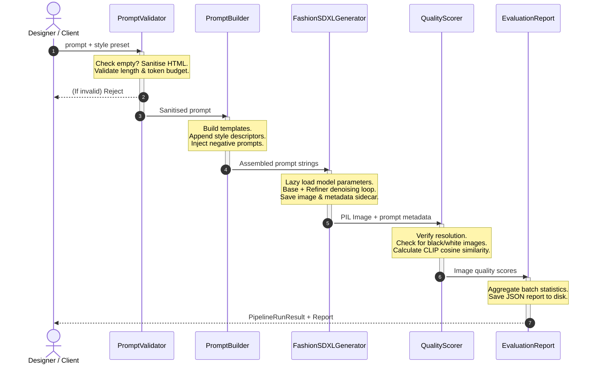

# Week 2 Technical Documentation: Text-to-Image Generation & Quality Evaluation Framework

This document serves as the developer and engineer reference manual for the Week 2 generative AI foundation of the AI-Powered Fashion Design Assistant.

---

## 1. Stable Diffusion XL (SDXL) Architecture

Stable Diffusion XL (SDXL) is a latent diffusion model developed by Stability AI. It significantly outperforms standard Stable Diffusion models in resolution, prompt alignment, and image fidelity.

### Architectural Breakdown

```
              ┌────────────────────────────────────────────────────────┐
              │                   Dual Text Encoders                   │
              │  1. CLIP ViT-L/14 (77 tokens)                          │
              │  2. OpenCLIP-G/14 (77 tokens)                          │
              └───────────────┬────────────────────────┬───────────────┘
                              │ Text Embeddings        │ Pooled Embeddings
                              ▼                        ▼
              ┌────────────────────────────────────────────────────────┐
              │                    Denoising UNet                      │
              │  - 3x Larger parameter size (2.6B parameters)          │
              │  - Denoising loop (Base: Steps 0-24, Refiner: 24-30)   │
              └──────────────────────────┬─────────────────────────────┘
                                         │ Latents (128x128)
                                         ▼
              ┌────────────────────────────────────────────────────────┐
              │                     VAE Decoder                        │
              │  - Translates latents to pixels (1024x1024)            │
              │  - sdxl-vae-fp16-fix to prevent NaN/black artifacts     │
              └──────────────────────────┬─────────────────────────────┘
                                         ▼
                                  [Final Image]
```

* **Parameters**: The base model uses a $2.6$ billion parameter UNet, while the refiner uses a $6.6$ billion parameter UNet, allowing the system to separate structure generation from detail refinement.
* **Latent Space**: Diffusion is performed in an $8 \times$ downscaled latent space. A $1024 \times 1024$ image is represented as a $128 \times 128 \times 4$ latent tensor.
* **Refiner Strategy**: Denoising steps are divided. The base model processes the first $80\%$ of steps (e.g., steps $0-24$), and the refiner takes the remaining $20\%$ (steps $24-30$) to denoise starting from the base model's intermediate latents.

---

## 2. Fashion Generation Workflow

The end-to-end processing pipeline runs through validation, composition, inference, and quality verification:



---

## 3. Detailed Prompt Engineering & Token Limits

### Dual CLIP Text Encoders & Conditioning
SDXL uses two separate text encoders in parallel:
1. **CLIP ViT-L/14**: Developed by OpenAI ($123\text{M}$ parameters), extracting $768$-dimensional tokens.
2. **OpenCLIP-G/14**: Developed by LAION ($354\text{M}$ parameters), extracting $1280$-dimensional tokens.

The hidden states of these two encoders are concatenated along the feature dimension, producing a conditioning vector of shape $(77, 2048)$ for cross-attention layers in the UNet.

### Token Limit Truncation Logic
Each text encoder enforces a rigid token limit of **77 tokens** (including start-of-text `<SOS>` and end-of-text `<EOS>` tokens, leaving **75 tokens** for prompts).
The `PromptValidator` estimates the token count of a given string using the formula:
$$\text{Tokens} \approx \text{Word Count} \times 1.3 + 2$$
If the estimated tokens exceed 77, the validator logs a warning and truncates the positive prompt to prevent loss of critical descriptive elements, ensuring that the most important subject descriptors are placed at the beginning of the prompt.

### Negative Prompts and Presets
Negative prompts are critical to prevent SDXL from generating anatomical mutations, low resolution, or poor fabrics. The standard fashion negative template used in the generator is:
```
blurry, out of focus, low quality, deformed, bad anatomy, watermark, text, signature, cropped, bad clothing, wrinkled fabric, dirty, stained, torn fabric, ill-fitting
```

---

## 4. CLIP Evaluation Methodology

To evaluate whether the generated image matches the input description, the framework utilizes **Contrastive Language-Image Pretraining (CLIP)**.

### Mathematical Formulation
The prompt $T$ and generated image $I$ are encoded using the text encoder $E_T$ and image encoder $E_I$ respectively:
$$\mathbf{v}_t = E_T(T), \quad \mathbf{v}_i = E_I(I)$$

These vectors are normalized to unit sphere coordinates:
$$\hat{\mathbf{v}}_t = \frac{\mathbf{v}_t}{\|\mathbf{v}_t\|_2}, \quad \hat{\mathbf{v}}_i = \frac{\mathbf{v}_i}{\|\mathbf{v}_i\|_2}$$

The semantic alignment score is the cosine similarity between the two unit vectors:
$$\text{CLIP Similarity} = \hat{\mathbf{v}}_t \cdot \hat{\mathbf{v}}_i = \frac{\mathbf{v}_t \cdot \mathbf{v}_i}{\|\mathbf{v}_t\|_2 \|\mathbf{v}_i\|_2}$$

### Alignment Thresholds
We map the raw similarity score to semantic categories specifically calibrated for fashion objects:

* **Very High Alignment ($\ge 0.30$)**: Exact match of colors, garment type, and fit.
* **High Alignment ($\ge 0.25$)**: Minor attribute mismatches, correct main garment.
* **Medium Alignment ($\ge 0.20$)**: Correct garment category, possible style drift. (Minimum acceptable threshold).
* **Low Alignment ($< 0.20$)**: Mismatched clothing or complete generation failure.

---

## 5. FID (Fréchet Inception Distance) Methodology

FID evaluates the quality and style diversity of a generated image batch against real target images.

### Mathematical Formulation
Assuming the feature activations of the real reference images ($X_r$) and generated images ($X_g$) follow multivariate Gaussian distributions:
$$X_r \sim \mathcal{N}(\mu_r, \Sigma_r), \quad X_g \sim \mathcal{N}(\mu_g, \Sigma_g)$$

The Fréchet distance between these two distributions is defined as:
$$d^2 = \|\mu_r - \mu_g\|_2^2 + \text{Tr}(\Sigma_r + \Sigma_g - 2(\Sigma_r\Sigma_g)^{1/2})$$

Where:
* $\mu_r, \mu_g$ are the mean feature vectors extracted from Inception V3.
* $\Sigma_r, \Sigma_g$ are the covariance matrices.
* $\text{Tr}$ is the trace operator (sum of diagonal elements).

### Backends Priority
The `FIDEvaluator` supports 4 fallback execution layers to operate in any environment:
1. `pytorch-fid`: Uses the official pytorch-fid package (standard).
2. `torchmetrics`: Standard PyTorch measurement framework.
3. `manual`: Implements the covariance square-root math manually using `scipy.linalg.sqrtm` over custom extracted Inception-v3 features.
4. `stub`: A graceful fallback returning `float("inf")` if deep learning frameworks are absent.

---

## 6. Centralized Config and Benchmarking Schema

### Config Structure (`configs/model_config.py`)
All parameters are managed by Pydantic v2 models:
* `CentralizedConfig`: Base schema mapping YAML structures to typed settings.
* Validates image dimensions (verifies they are divisible by 8 as required by latent diffusion autoencoders).
* Environment variables prefixed with `FASHION_CONFIG_` override file configurations (e.g. `FASHION_CONFIG__model__runtime__device=cuda`).

### Benchmark Schema (`benchmark_report.json`)
The combinatorial benchmark framework outputs a structured JSON summarizing performance across CFG scales, noise schedulers, and resolutions:

```json
{
  "benchmark_id": "BENCH_20260622_120000",
  "generated_at": "2026-06-22T00:31:36Z",
  "configurations": {
    "prompts": ["a silk dress", "a leather jacket"],
    "seeds": [42, 100],
    "resolutions": ["1024x1024"],
    "cfg_scales": [7.0, 9.0]
  },
  "metrics": {
    "total_runs": 8,
    "average_generation_time_s": 5.42
  },
  "results": [
    {
      "run_id": "RUN_0001",
      "prompt": "a silk dress",
      "seed": 42,
      "cfg_scale": 7.0,
      "resolution": "1024x1024",
      "scheduler": "euler",
      "generation_time_s": 5.12,
      "clip_score": 0.284,
      "quality_report": {
        "sharpness": 88,
        "contrast": 90,
        "quality": "excellent"
      }
    }
  ]
}
```

---

## 7. Folder Structure Reference

```
week2/
├── config_manager.py           # Config loader parsing YAML & Env overrides
├── logging_setup.py            # Loguru logger supporting 4 rotated sinks
├── generate.py                 # CLI interface for model generation
│
├── configs/                    # YAML configuration schemas
│   ├── generation_config.yaml  # Inference parameters & size presets
│   ├── model_config.yaml       # HF weights repo IDs & hardware offload settings
│   ├── prompt_config.yaml      # Style presets & category templates
│   └── evaluation_config.yaml  # CLIP/FID thresholds & reports paths
│
├── generator/                  # Core Image Generation Engine
│   ├── sdxl_generator.py       # FashionSDXLGenerator & GenerationOutput
│   ├── model_manager.py        # Lazy loading, VRAM allocation & GPU offload
│   ├── scheduler_factory.py    # Noise scheduler factory (11 registries)
│   └── image_processor.py      # Watermarking, resizing & metadata embedding
│
├── prompts/                    # Natural Language Interfaces
│   ├── prompt_builder.py       # Assembles prompt tags, styles & categories
│   ├── prompt_validator.py     # Token length counting & sanitization
│   └── negative_prompts.py     # Curated negative prompt library
│
├── evaluation/                 # Image Quality Assessment
│   ├── metrics.py              # CLIP similarity, black/white check, SSIM/PSNR
│   ├── quality_scorer.py       # Weighted composite quality score calculator
│   ├── fid_evaluator.py        # Fréchet Inception Distance calculator
│   └── evaluation_report.py    # Aggregate JSON reporter
│
├── pipelines/                  # Processing Pipelines
│   ├── base_pipeline.py        # Base pipeline class with lifecycle Hooks
│   └── text2image_pipeline.py  # Single prompt generation execution
│
└── tests/                      # Pytest Suite
    ├── conftest.py             # Config & image stubs
    └── test_*.py               # Component-level tests
```

---

## 8. Challenges & Engineering Solutions

* **SQLite Locking**: Concurrency in SQLite is solved by:
  ```python
  # Enable Write-Ahead Logging for SQLite
  conn.execute("PRAGMA journal_mode=WAL;")
  ```
  And running write statements inside a mutual exclusion lock (`threading.Lock`).
* **Dataclass Falsy Bug**: Avoid `if tracker` (which triggers `__len__ == 0` check when empty) by running:
  ```python
  if tracker is not None:
      # Tracker exists, log experiment
  ```

---

## 9. Future Work: ControlNet Integration Blueprint

To direct the generative layout of garments, we propose incorporating ControlNet, a neural network architecture designed to add spatial conditioning controls to diffusion models.

### Conditioning Mechanism
In traditional diffusion, the model is conditioned solely on text embeddings $c_t$. ControlNet introduces a spatial conditioning tensor $c_f$ (e.g. an edge map or skeletal pose):
$$\epsilon_\theta(z_t, t, c_t, c_f)$$

It locks the original SDXL UNet weights and creates a copy of the encoder blocks connected via $1 \times 1$ convolutions (zero convolutions), ensuring stable training and zero degradation of original image quality.

```
       Control Input (Canny / Pose) ──► ControlNet Encoder
                                                │
                                                ▼ (Zero Convolution)
[Locked SDXL Encoder] ──────────────────► [SDXL Decoder] ──► Output Latents
```

### Proposed Configuration Schema
```yaml
controlnet:
  enabled: true
  model_id: "diffusers/controlnet-canny-sdxl-1.0"
  conditioning_scale: 0.8
  detectors:
    canny:
      low_threshold: 100
      high_threshold: 200
    openpose:
      detect_hand_and_face: true
```

---

## 10. References
1. Podell, D., et al. (2023). *SDXL: Improving Latent Diffusion Models for High-Resolution Image Synthesis*. arXiv:2307.01952.
2. Radford, A., et al. (2021). *Learning Transferable Visual Models From Natural Language Supervision (CLIP)*. ICML.
3. Heusel, M., et al. (2017). *GANs Trained by a Two Time-Scale Update Rule Converge to a Local Nash Equilibrium (FID)*. NeurIPS.
4. Zhang, L., et al. (2023). *Adding Conditional Control to Text-to-Image Diffusion Models (ControlNet)*. ICCV.
