# Week 4: Brand Style Personalization Technical Documentation

**Role:** Senior Generative AI Research Engineer  
**Scope:** Parameter-Efficient Style Adapter Fine-Tuning, Switching, Mixing, and Quality Evaluation Systems.

---

## 1. LoRA Architectural Foundations

Low-Rank Adaptation (LoRA) adapts large pre-trained diffusion models to specific styles by freezing the original weights $W_0 \in \mathbb{R}^{d \times k}$ and injecting trainable rank decomposition matrices.

### Mathematical Formulation
The forward pass for a weight layer modified by LoRA is:

\[h = W_0 x + \Delta W x = W_0 x + \frac{\alpha}{r} B A x\]

Where:
* $W_0 \in \mathbb{R}^{d \times k}$ is the frozen pre-trained weight matrix.
* $B \in \mathbb{R}^{d \times r}$ and $A \in \mathbb{R}^{r \times k}$ are the low-rank matrices.
* $r \ll \min(d, k)$ is the rank (configured to $8$).
* $\alpha$ is a constant scaling hyperparameter (configured to $16$).
* $x$ is the input vector.

By training only $A$ and $B$, we reduce the optimizer memory footprint significantly while preserving the generalized knowledge of the base SDXL pipeline.

---

## 2. System Architecture & Component Mapping

The personalization system is organized under `week4/` with distinct packages for datasets, trainers, style managers, inference, and evaluations:

```mermaid
graph TD
    subgraph Dataset Ingestion
        A[BrandDatasetManager] -->|Validates & Caption| B(Manifest)
    end
    subgraph LoRA Training
        C[LoraTrainer] -->|Mixed Precision fp16| D(Model Checkpoint)
        E[KohyaPipeline] -->|CLI Automation| F(nike/gucci/zara/hm_style.safetensors)
    end
    subgraph Style Management
        G[LoraRegistry] -->|Database Index| H(lora_registry.json)
        I[StyleSwitcher] -->|Dynamic Swapping| J[StyleMixer]
    end
    subgraph Generative Inference
        K[LoraInferenceSystem] -->|Base SDXL / Mock| L[PersonalizedFashionGenerator]
        L -->|Outputs & Sidecars| M(design_*.png + metadata_*.json)
    end
    subgraph Performance Evaluation
        N[FashionStyleEvaluator] -->|Metrics| O[LoraExperimentTracker]
        P[BrandComparisonFramework] -->|Reports| O
    end
```



---

## 3. Detailed Component APIs

### 3.1 LoRA Model Registry (`LoraRegistry`)
Manages model paths, memory load states, and active scales in a JSON database.

* **File Location:** `week4/style_manager/lora_registry.py`
* **Key Methods:**
  * `register_model(brand: str, model_path: Union[str, Path], metadata: Optional[Dict[str, Any]]) -> Dict[str, Any]`
  * `load_model(brand: str) -> Dict[str, Any]`
  * `activate_model(brand: str, scale: float) -> Dict[str, Any]`
  * `deactivate_model(brand: str) -> Dict[str, Any]`
  * `list_models(filter_active: bool) -> Dict[str, Dict[str, Any]]`

### 3.2 Dynamic Style Switcher (`StyleSwitcher`)
Appends brand presets to prompts and handles dynamic swaps on the inference pipeline.

* **File Location:** `week4/style_manager/style_switcher.py`
* **Key Methods:**
  * `switch_style(brand: str, scale: float) -> None`
  * `preprocess_prompt(prompt: str, brand: str) -> str`
  * `generate_styled_design(prompt: str, brand: str, scale: float, dry_run: bool) -> Dict[str, Any]`

### 3.3 Style Mixer System (`StyleMixer`)
Manages multi-adapter blending ratios, normalizes weights, and builds interpolated prompts.

* **File Location:** `week4/style_manager/style_mixer.py`
* **Key Methods:**
  * `mix_styles(brand_weights: Dict[str, float]) -> Dict[str, float]`
  * `generate_blended_prompt(prompt: str, brand_weights: Dict[str, float]) -> str`
  * `generate_mixed_design(prompt: str, brand_weights: Dict[str, float], dry_run: bool) -> Dict[str, Any]`

### 3.4 Production Inference Engine (`LoraInferenceSystem`)
Coordinates base SDXL pipeline loading, dynamic weight swapping, and metadata sidecar serialization.

* **File Location:** `week4/inference/lora_inference.py`
* **Key Methods:**
  * `load_pipeline() -> None`
  * `generate(prompt: str, brand: str, scale: float, seed: Optional[int]) -> Dict[str, Any]`
  * `generate_batch(prompts: List[str], brands: List[str], scales: List[float], ...) -> List[Dict[str, Any]]`

### 3.5 Fashion Style Evaluator (`FashionStyleEvaluator`)
Measures color alignments, SSIM, CLIP prompt similarity, and image quality.

* **File Location:** `week4/evaluation/style_evaluator.py`
* **Key Methods:**
  * `measure_image_quality(image: Image.Image) -> float`
  * `evaluate(image: Image.Image, prompt: str, brand: str, reference_image: Optional[Image.Image]) -> Dict[str, float]`

### 3.6 LoRA Experiment Tracker (`LoraExperimentTracker`)
Tracks and queries runs, optimizing for metric targets (min loss, max scores).

* **File Location:** `week4/evaluation/lora_tracker.py`
* **Key Methods:**
  * `log_experiment(brand: str, lora_version: str, training_loss: float, ...) -> Dict[str, Any]`
  * `get_best_run(metric: str, brand: Optional[str]) -> Optional[Dict[str, Any]]`
  * `get_statistics() -> Dict[str, Any]`

---

## 4. Code Implementation Examples

### 4.1 Personalized Generation Pipeline Setup
```python
from PIL import Image
from week4.style_manager.lora_registry import LoraRegistry
from week4.inference.lora_inference import LoraInferenceSystem
from week4.inference.personalized_generator import PersonalizedFashionGenerator

# 1. Setup registry and register trained adapter
registry = LoraRegistry(registry_path="outputs/demo/registry.json")
registry.register_model(brand="nike", model_path="outputs/trainers/nike_style.safetensors")

# 2. Setup inference system (dry_run=True for CPU test environments)
inference_system = LoraInferenceSystem(registry=registry, dry_run=True)

# 3. Setup personalized generator
generator = PersonalizedFashionGenerator(inference_system=inference_system)

# 4. Generate design based on user profile preferences
user_profile = {
    "favorite_brand": "nike",
    "favorite_color": "black",
    "preferred_style": "streetwear"
}

result = generator.generate_personalized_design(
    base_item="hoodie",
    preferences=user_profile,
    scale=1.0,
    seed=42
)

print(f"Generated Image Path: {result['image_path']}")
print(f"Sidecar Metadata Path: {result['metadata_path']}")
```

### 4.2 Evaluating Styles & Tracking Experiments
```python
from PIL import Image
from week4.evaluation.style_evaluator import FashionStyleEvaluator
from week4.evaluation.lora_tracker import LoraExperimentTracker

# Initialize evaluator and tracker
evaluator = FashionStyleEvaluator()
tracker = LoraExperimentTracker(output_dir="outputs/experiments")

# Evaluate generated design
image = Image.open("outputs/demo/design_nike_sample.png")
prompt = "A sleek black sportswear hoodie"
scores = evaluator.evaluate(image=image, prompt=prompt, brand="nike")

# Log run details to central index registry database
tracker.log_experiment(
    brand="nike",
    lora_version="nike_v1.0",
    training_loss=0.03452,
    validation_score=0.89,
    clip_score=0.31,
    style_similarity=scores["style_similarity"]
)

# Query aggregate metrics
stats = tracker.get_statistics()
print(f"Global average style similarity: {stats['global']['mean_style_similarity']}")
```

---

## 5. Verification & Coverage Testing

All test suites are written using `pytest`. Standalone execution for the week 4 package is managed by `week4/tests/run_week4_tests.py`:

```bash
python week4/tests/run_week4_tests.py
```

### Coverage Statistics
* **Passing Assertions:** $100\%$ ($83/83$ Week 4 tests passed successfully).
* **Package Coverage:** **$92.86\%$** on `week4` namespace modules.
* **Global Repository Coverage:** **$86.70\%$** (well above the $80\%$ minimum threshold).
