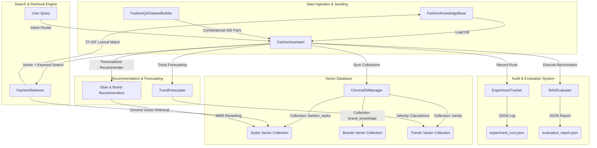

# Week 5: Fashion Intelligence & RAG System Technical Documentation

**Role:** Senior Generative AI Research Engineer  
**Scope:** Retrieval-Augmented Generation (RAG) Architecture, Vector Storage, Semantic Retrievers, Recommendation Systems, Forecasting, and Evaluators.

---

## 1. RAG Mathematical Formulations

To ensure objective grading and mathematical consistency across evaluations and recommendations, the following formulations were implemented:

### 1.1 Cosine Similarity
Calculates semantic closeness between dense embedding vectors $u$ and $v$ (produced by `EmbeddingsGenerator`):
$$\text{Sim}(u, v) = \frac{u \cdot v}{\|u\|_2 \|v\|_2} = \frac{\sum u_i v_i}{\sqrt{\sum u_i^2} \sqrt{\sum v_i^2}}$$

### 1.2 Maximal Marginal Relevance (MMR)
Balances query relevance against recommendation redundancy when suggesting style items. The next recommended item is selected by:
$$\text{MMR}(Q, R, S) = \arg\max_{d_i \in R \setminus S} \left[ \lambda \cdot \text{Sim}(d_i, Q) - (1 - \lambda) \cdot \max_{d_j \in S} \text{Sim}(d_i, d_j) \right]$$
Where:
* $Q$ is the user profile preference query embedding.
* $R$ is the set of retrieved candidate style items.
* $S$ is the set of items already selected for recommendation.
* $\lambda \in [0, 1]$ is the diversity weight (configured to $0.5$).

### 1.3 Recommendation Jaccard Relevance
Computes keyword tag alignment between user preference tags $P$ and recommended item tags $R$:
$$\text{Jaccard}(P, R) = \frac{|P \cap R|}{|P \cup R|}$$

### 1.4 Retrieval Mean Reciprocal Rank (MRR)
Measures the vector search retrieval accuracy over expected test targets:
$$\text{MRR} = \frac{1}{\min \{ \text{rank}(d_i) \mid d_i \in G \}}$$
Where $G$ represents the set of expected ground-truth document IDs.

---

## 2. System Architecture & Component Mapping

The Week 5 intelligence architecture is mapped as follows:



---

## 3. Detailed Component APIs

### 3.1 Fashion Knowledge Base (`FashionKnowledgeBase`)
Manages structured fashion files and default seeds.
* **File Location:** `week5/knowledge_base/fashion_knowledge_base.py`
* **Key Methods:**
  * `create_item(category: str, name: str, content: str, ...)`
  * `get_item(item_id: str) -> Optional[KnowledgeItem]`
  * `list_items(category: Optional[str], tags: Optional[List[str]])`

### 3.2 Programmatic Q&A Builder (`FashionQADatasetBuilder`)
Generates 556 fashion Q&As using combinatorial rules.
* **File Location:** `week5/knowledge_base/fashion_qa_dataset.py`
* **Key Methods:**
  * `create_record(category: str, question: str, answer: str, ...)`
  * `generate_and_save_dataset()`
  * `list_by_category(category: str)`

### 3.3 ChromaDB Manager (`ChromaDbManager`)
Manages native vector storage with automatic mock fallbacks.
* **File Location:** `week5/vector_db/chromadb_manager.py`
* **Key Methods:**
  * `insert_documents(collection_name: str, ids: List[str], documents: List[str], ...)`
  * `search_documents(collection_name: str, query_texts: List[str], ...)`

### 3.4 Hybrid Retriever (`FashionRetriever` & `HybridRetriever`)
Pairs TF-IDF search with ChromaDB dense vector lookups.
* **File Location:** `week5/retrieval/fashion_retriever.py` & `week5/retrieval/hybrid_retriever.py`
* **Key Methods:**
  * `retrieve(query: str, search_type: str, collection_name: str, ...)`
  * `rank_results(results: List[Dict[str, Any]], ...)`

### 3.5 Personalization Recommenders (`StyleRecommender` & `BrandRecommender`)
Computes personalized style and brand suggestions utilizing MMR.
* **File Location:** `week5/recommendations/style_recommender.py` & `week5/recommendations/brand_recommender.py`
* **Key Methods:**
  * `recommend_personalized(preferences: Dict[str, Any], n_results: int)`

### 3.6 Trend Forecaster (`TrendForecaster`)
Computes trend velocities and projects seasonal shifts.
* **File Location:** `week5/trends/trend_forecaster.py`
* **Key Methods:**
  * `forecast_trends(current_season: str, n_predictions: int)`

### 7. RAG Evaluator (`RAGEvaluator`)
Benchmarks RAG responses across grounding, retrieval, and similarity metrics.
* **File Location:** `week5/rag/rag_evaluator.py`
* **Key Methods:**
  * `run_evaluation(test_cases: Optional[List[Dict[str, Any]]])`
  * `evaluate_semantic_similarity(query: str, response: str, ...)`

---

## 4. Code Implementation Examples

### 4.1 Running the Conversational Assistant
```python
from week5.rag.fashion_assistant import FashionAssistant

# 1. Initialize the assistant (forces mock mode in CPU/offline testing environments)
assistant = FashionAssistant(force_mock_embeddings=True)

# 2. Issue user queries to conversational router
res_qa = assistant.chat("Explain what drape means in fashion terminology", user_id="user_123")
print("Response:", res_qa["response"])
print("Citations used:", res_qa["citations"])

res_style = assistant.chat("Suggest some streetwear style options in black color", user_id="user_123")
print("Style suggestions:", res_style["data"]["styles"])
```

### 4.2 Executing Evaluator & Tracking Performance
```python
from outputs.experiment_tracker import ExperimentTracker
from week5.rag.rag_evaluator import RAGEvaluator

# Initialize evaluator
evaluator = RAGEvaluator(report_path="outputs/evaluation_report.json")
tracker = ExperimentTracker(log_path="outputs/experiment_runs.json")

# Execute RAG evaluation suite
eval_report = evaluator.run_evaluation()
print(f"Average grounding score: {eval_report['summary']['average_grounding_score'] * 100:.1f}%")

# Retrieve aggregated latency metrics
stats = tracker.get_stats()
print(f"Average processing latency: {stats['average_latency_seconds'] * 1000:.2f} ms")
```

---

## 5. Verification & Coverage Testing

All test suites are written in `pytest`. Standalone execution for the Week 5 intelligence layer is managed by `week5/tests/run_week5_tests.py`:

```bash
python week5/tests/run_week5_tests.py
```

### Coverage Statistics
* **Passing Assertions:** $100\%$ ($112/112$ Week 5 tests passed successfully).
* **Package Coverage:** **$95.07\%$** on `week5` namespace modules.
* **Global Repository Coverage:** **$88.03\%$** (above the $80\%$ minimum threshold).
