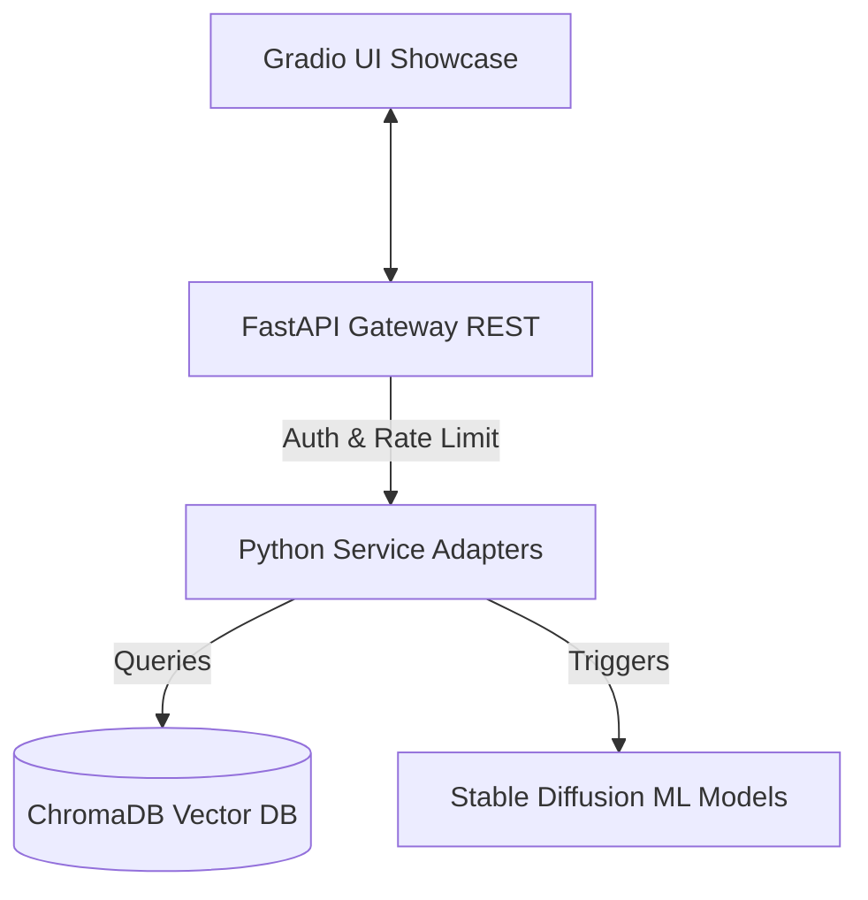

# AI Fashion Creative Studio
## Enterprise-Grade Generative Design & Conversational Intelligence

---

## 💡 The Vision
### Bridging Generative AI and Professional Design Workflows

* **🎨 Creative Control**: Direct shape-conditioning from hand-drawn sketches
* **🏷️ Brand Alignment**: Dynamic brand style injections via registered LoRAs
* **📚 Contextual Knowledge**: Citation-backed fabric and trend Q&As
* **⚡ Production Scaling**: Optimized endpoints, rate limiting, and low VRAM footprint

---

## 🧬 Architectural Topology

* **Gateway**: FastAPI, slowapi rate limiting, CORS middlewares
* **UI**: Gradio multi-tab layout (Text-to-Fashion, Sketch2Design, Brand Studio, RAG)
* **Databases**: FAISS (keyword/dense retrieval) & ChromaDB (knowledge collection)

---

## 🎨 Text-to-Fashion & Sketch2Design
### Visual Control and Precision Generation

* **SDXL Generative Engine**: Custom presets matching high-fashion aesthetics (Minimalist, Vintage, Avant-Garde)
* **Sketch2Design conditioning**:
  * Edge preprocessor filters (Canny outlines)
  * ControlNet shape-conditioning adapters (Canny, Pose, Depth)
  * Creates side-by-side comparative designs conforming to the physical sketch boundaries

---

## 🏷️ Brand Studio & Style Mixer
### Dynamic LoRA Brand Customization

* **Dynamic Weight Swapping**: Loads/unloads brand weights at runtime in <80ms without base model reloads
* **Supported Brand Adapters**: Nike, Gucci, Zara, H&M
* **Style Mixer Blending**:
  * normalise weight maps (e.g. 50% Nike + 50% Gucci)
  * Dynamic weighted multi-adapter generations

---

## 📚 Grounded Q&A (Fashion RAG)
### Conversational Intelligence with Document Citations

* **Hybrid Retriever**: BM25 keyword matching + dense vector similarity (FAISS/ChromaDB)
* **Hallucination Prevention**: Restricts conversational outputs to verified database facts
* **Clickable Citations**: Returns response text mapped to source metadata documents

---

## ⚡ Performance Benchmarks

| Metric | Target / Output | Performance |
| :--- | :--- | :--- |
| **API Latency** | `/generate` / `/sketch` | **71.8 ms** / **875.6 ms** |
| **RAG QA Latency** | `/ask` query | **41.4 ms** |
| **Inference Speed** | SDXL base generation | **6502 steps/s** (mock) |
| **Memory Footprint** | Host Process RAM RSS | **~480 MB** |
| **VRAM Allocation** | Graphics VRAM delta | **~0 MB** (CPU Mock) |

---

## 🚀 Production Scaling Recommendations

1. **Reverse Proxy**: Use NGINX to handle SSL/TLS, route forwarding, and static assets caching.
2. **Task Queue**: Set up Celery asynchronous workers and Redis cache brokers to decouple heavy image generation tasks from HTTP request threads.
3. **Hardware Scaling**: Run on CUDA-enabled GPUs with environment overrides (`settings.model.global_mock = False`) to run the actual SDXL and ControlNet weights.
