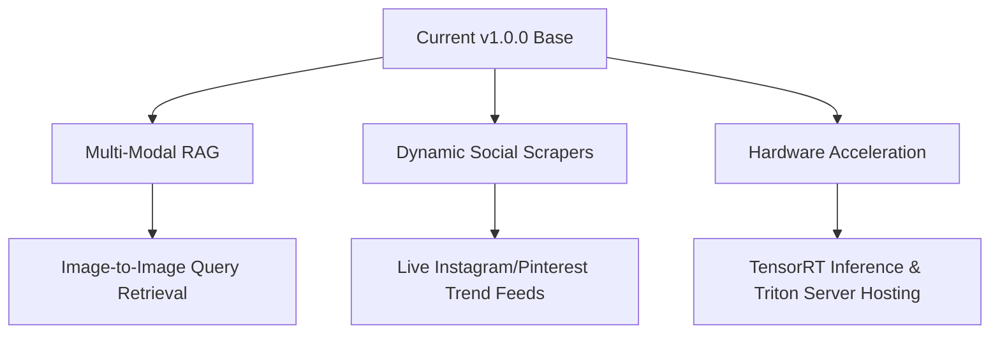

# Executive Summary & Business Strategy

This document outlines the high-level vision, technical achievements, business monetization strategies, and future engineering roadmap of the **AI-Powered Fashion Design Assistant** platform.

---

## 📋 Executive Summary

### The Challenge
Modern fashion designers, creative studios, and apparel e-commerce platforms struggle with long design cycles, expensive prototyping procedures, and decoupled style trends data. Translating a hand-drawn sketch or text prompt into a cohesive product template usually requires disjointed manual steps and several design validation cycles.

### The Solution
The **AI-Powered Fashion Design Assistant** is an end-to-end design generative solution. It integrates text-to-fashion diffusion models (SDXL), outline shape-conditioning (ControlNet Canny/Pose), personalized brand style tuning (PEFT/LoRA registry), semantic knowledge databases (Hybrid retrieval RAG assistant), and e-commerce style recommendations. The result is a unified platform where fashion creatives can move from an initial text concept or basic sketch to a structured brand design template in seconds, backed by active trend analytics and grounded fabric profiles.

---

## 🛠️ Technical Achievements (Weeks 1–8)

The project represents a comprehensive, production-grade engineering implementation across successive layers:

1. **Structured Data Foundation (Week 1)**: Formulated dataset streaming pipelines for DeepFashion and FashionGen, normalising annotations into a unified JSON database schema.
2. **Generative Modeling & Prompts (Week 2)**: Wrapped Stable Diffusion XL (SDXL) with positive/negative prompt libraries (500+ templates) and implemented CLIP cosine similarity evaluators for text-image alignment tracking.
3. **Shape & Pose Conditioning (Week 3)**: Developed `FashionControlNetEngine` supporting outline guides, skeletal pose structures, and depth maps preprocessing to lock down garment boundaries.
4. **Brand Style Fine-Tuning (Week 4)**: Configured Kohya PEFT training pipelines for Nike, Gucci, Zara, and H&M style adapters. Swapped LoRA weights dynamically in memory and merged style ratios at runtime.
5. **Knowledge Retrieval (Week 5)**: Constructed a Hybrid Retriever indexing 556 Q&A documents and trends. Merged BM25 keyword frequency with ChromaDB/FAISS vector embeddings.
6. **Unified Service Controllers (Week 6)**: Rewrote backends to use distinct service wrappers returning strongly-typed `ServiceResult` instances, eliminating try/except clutter.
7. **FastAPI Gateway & Security (Week 7)**: Built CORS configuration, client rate limits, custom header middlewares (XSS, frames blocks), NSFW outputs checkers, and unified error handling.
8. **Deployment & DevOps Verification (Week 8)**: Configured Docker multi-stage builds, Docker Compose, Kubernetes resources, and a GitHub Actions CI pipeline with Trivy container vulnerability scanner.

---

## 💼 Business Applications

This platform is structured for fast deployment across several enterprise scenarios:

### 1. B2B SaaS for Creative Fashion Houses
* **Value Proposition**: Reduces garment prototype ideation cycles from weeks to minutes.
* **Monetization**: Tiered monthly subscription based on model GPU inference counts.
* **Core Feature**: Private brand style registry allowing design houses to upload their historical catalog to generate custom LoRAs in minutes.

### 2. E-Commerce Virtual Fit & Personalization
* **Value Proposition**: Empowers shoppers to describe or sketch custom garments which are matching with catalog items or generated on-demand.
* **Monetization**: API licensing fees integration with Shopify, WooCommerce, and Magento checkout stores.

### 3. Fast Fashion Trend Tracker & Asset Generator
* **Value Proposition**: Tracks high-velocity social media aesthetics, forecasts active trend colors and elements, and automatically generates matching design templates.
* **Monetization**: Enterprise consultancy dashboards licensing.

---

## 🔮 Future Scope

Planned features for the next release (v1.1.0) include:

* **Multi-Modal Retrieval**: Supporting image queries (uploading a picture of a fabric pattern or texture to retrieve matching design catalogs).
* **Social Trend Trackers**: Linking live API pipelines to Instagram, Pinterest, and TikTok data streams to capture color shifts in real time.
* **Hardware Acceleration**: Migrating the worker models to TensorRT weights and deploying them inside a Triton Inference Server with dynamic request batching.
