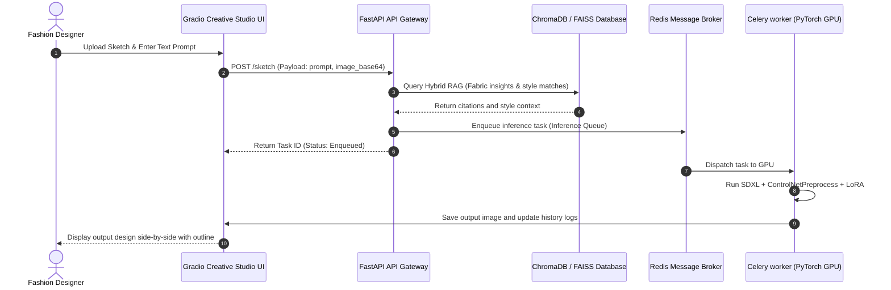
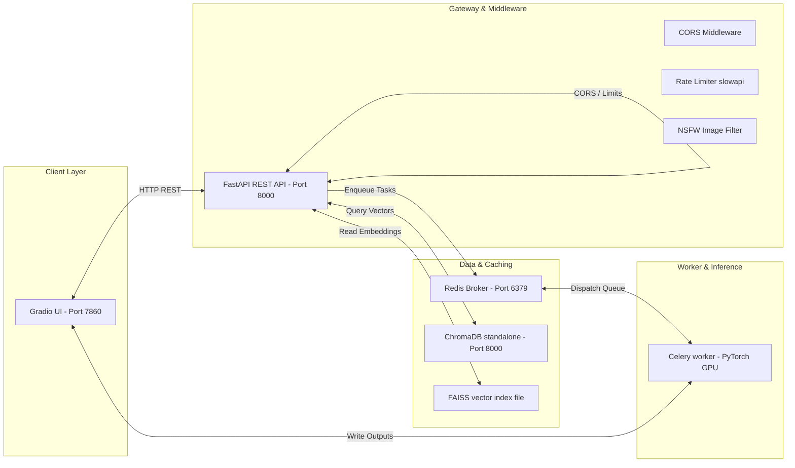

# Feature Demonstrations & System Architecture

This document presents the visual architecture topologies, core module descriptions, and portfolio outputs of the **AI-Powered Fashion Design Assistant** platform.

---

## 🎨 System Architecture Diagrams

### 1. High-Level Operations & Messaging Flows

The system coordinates synchronous user HTTP requests via a FastAPI REST API Gateway while offloading heavy GPU model inferences to a background Celery worker pool managed by a Redis message broker:

### 2. Microservice Topology

The modular deployment architecture allows for rapid, independent scaling of the API Gateway, standalone vector databases, and PyTorch execution runtimes:

---

## 🚀 Module Feature Demonstrations

### 1. Text-to-Fashion (SDXL Concept Design)
* **API Route**: `POST /generate`
* **Gradio Tab**: `Text-to-Fashion`
* **Features**: Prompts are validated against empty inputs or long string injections. Curated style triggers (e.g. *Streetwear Editorial*, *Luxury Fashion Week*) are appended automatically to shape base generations.

### 2. Sketch2Design (ControlNet Image Guidance)
* **API Route**: `POST /sketch`
* **Gradio Tab**: `Sketch2Design`
* **Features**: Users upload a drawing, line-art silhouette, or outline pose. Preprocessors extract Canny edge matrices to enforce strict structural boundaries on the generated output garment.

### 3. Brand Styling LoRA Mixer
* **API Route**: `POST /lora` and `POST /style-mix`
* **Gradio Tab**: `Brand LoRA Studio`
* **Features**: Activates PEFT adapters dynamically at runtime. Generates sportswear (Nike), high-fashion (Gucci), or casual retail (Zara, H&M) aesthetics. Supports mixing adapters by custom weight scales (e.g. 50% Nike + 50% Gucci).

### 4. Grounded Fashion RAG Q&A
* **API Route**: `POST /ask`
* **Gradio Tab**: `Fashion Assistant Chat`
* **Features**: Queries the vector index for fabric qualities, styling advice, and forecast information. Responses return annotated citations (e.g. `[KB-003]`) detailing the exact source record.

### 5. Personalization recommendations
* **API Route**: `POST /api/v1/recommendations/styles`
* **Gradio Tab**: `Style Recommendation`
* **Features**: Generates recommendation lists matching user style category, occasion, and fit preferences.

---

## 📂 Example Outputs & Portfolio Index

The platform automatically populates design outputs to support portfolio building. The complete portfolio directory structure can be navigated here:

* **HTML Filterable Portfolio Portal**: Open [portfolio/index.html](file:///c:/Users/HP/Desktop/AI%20Fashion%20Agent/fashion-ai-assistant/portfolio/index.html) to interactively inspect design cards.
* **Portfolio Index Summary**: Read the markdown description index [portfolio.md](file:///c:/Users/HP/Desktop/AI%20Fashion%20Agent/fashion-ai-assistant/portfolio/portfolio.md).
* **Generation Output Examples**: Explore [portfolio/fashion_generation/](file:///c:/Users/HP/Desktop/AI%20Fashion%20Agent/fashion-ai-assistant/portfolio/fashion_generation/).
* **Sketch2Design Preprocessed Previews**: Compare preprocessed edge frames side-by-side with designs in [portfolio/sketch2design/](file:///c:/Users/HP/Desktop/AI%20Fashion%20Agent/fashion-ai-assistant/portfolio/sketch2design/).
* **Style Mixed Design Outputs**: View multi-adapter mixtures in [portfolio/lora/](file:///c:/Users/HP/Desktop/AI%20Fashion%20Agent/fashion-ai-assistant/portfolio/lora/).
