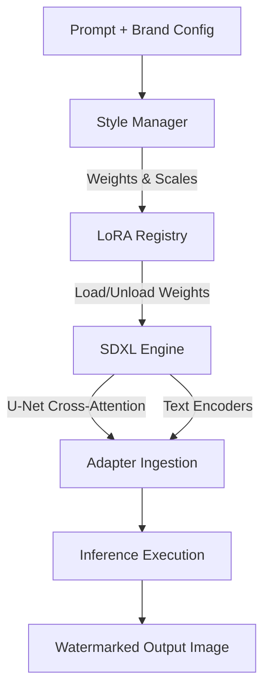

# Week 4 — System Architecture

This document describes the architectural design of the **LoRA Personalization & Brand Studio** layer and how it integrates with the base Stable Diffusion XL (SDXL) model.

---

## 🧱 Layer Overview

The Personalization layer sits between the prompt engineering modules and the core diffusion generation pipeline. It acts as an adapter interceptor, dynamically mutating the cross-attention layers of the text encoders and U-Net before inference.

---

## ⚙️ Component Breakdown

### 1. LoRA Registry (`lora_registry.py`)
Provides a thread-safe registry mapping brand names to local weights directory and default hyperparameters.
- **Dynamic Mounting**: Automatically scans directories for `.safetensors` files.
- **Metadata Association**: Associates adapters with base triggers (e.g., `"nike style"`, `"gucci luxury"`).

### 2. Style Switcher (`style_switcher.py`)
Handles target swapping of adapters inside the active pipeline session.
- **Zero-downtime Switching**: Instead of reloading the massive base model, it unloads active adapter layers using HuggingFace's PEFT wrapper methods and loads the new target adapter in milliseconds.
- **Clean State Recovery**: Restores base weights when all adapters are disabled to prevent bleed-over.

### 3. Style Mixer (`style_mixer.py`)
Combines multiple LoRA adapters with distinct weight coordinates.
- **Cross-Attention Merging**: Sets active adapters simultaneously using weighted combinations (e.g., `pipe.set_adapters(["nike", "gucci"], adapter_weights=[0.6, 0.4])`).
- **Safety Clamping**: Ensures merged weights do not exceed saturation thresholds (typically `<= 1.2`) to prevent image artifacting and color distortion.

### 4. Fine-Tuning Pipeline (`trainers/`)
Provides scripts for dataset tokenization, metadata generation, and training loop parameters.
- **Rank (r) and Alpha Selection**: Standardized to `rank=8` or `rank=16` with `alpha=16` for optimal balance between training speed and expression preservation.
- **Kohya Script Integration**: Wraps standard Kohya CLI options in a clean, schema-verified Python config class (`kohya_pipeline.py`).
