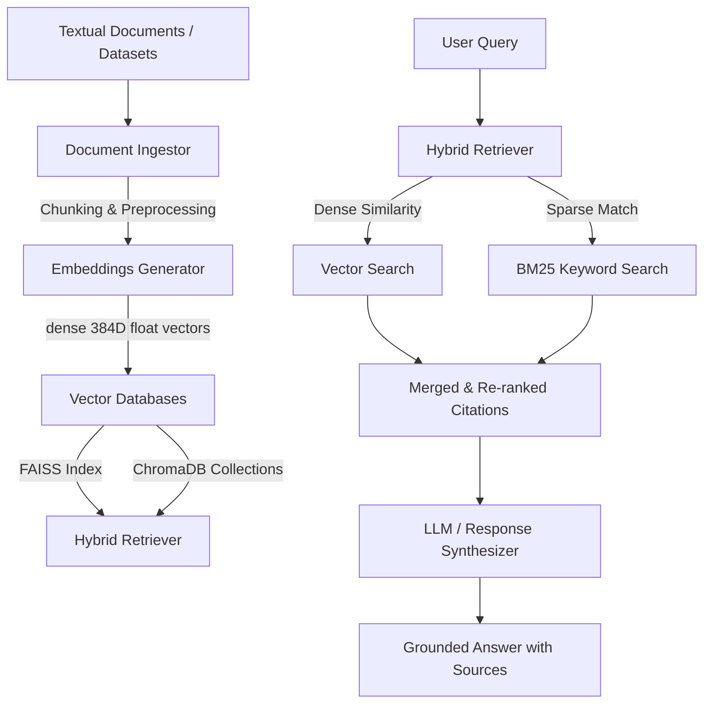
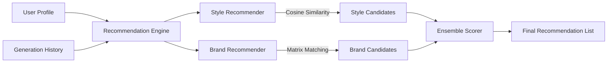

# Week 5 — System Architecture

This document describes the architectural flow of the **Retrieval-Augmented Generation (RAG) & Recommendation Engine** layer.

---

## 💬 RAG Information Flow

The RAG pipeline provides grounded domain knowledge to the conversational assistant. It ensures responses are supported by verified fashion literature, avoiding hallucinated recommendations.

---

## 👗 Recommendation Matching Engine

The recommendation system consists of two parts:
1. **Style Recommender**: Maps visual preferences, color choices, and silhouettes.
2. **Brand Recommender**: Matches budget, aesthetics, and values with brand profiles (Nike, Gucci, Zara, H&M).

- **User Profile Manager**: Manages session state and persists historical interaction vectors in a local JSON storage (`outputs/recommendations/user_profile.json`).
- **Embedding Alignment**: Computes cosine similarity between user prompt embeddings and category index profiles to rank interest scores across 12+ styles.

---

## 📈 Trend Forecasting Engine

The Trend Forecasting module uses a statistical time-series model to calculate the velocity and acceleration of fashion category popularity metrics.
- **Velocity Tracker**: Measures week-over-week growth rate of search query matches.
- **Seasonality Offset**: Adjusts scores dynamically based on the current system date (spring/summer vs autumn/winter weights).
- **Faiss Storage**: Indexes trend nodes to allow instant semantic similarity mapping against newly generated user prompt requests.
