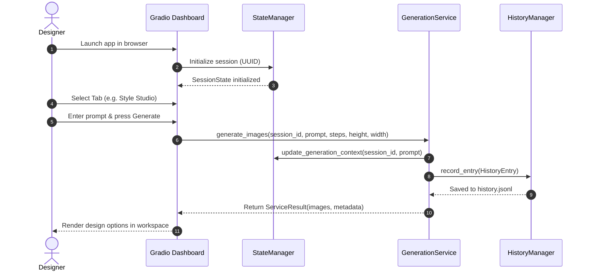

# Week 6 Technical Documentation: AI Fashion Creative Studio

This documentation details the architecture, design choices, state model, and service adapter specifications of the Gradio AI Fashion Creative Studio.

---

## 1. Gradio Architecture & Component Hierarchy

The Creative Studio is implemented as a single-page tabbed dashboard using the `gradio` package. The component layout forms a strict tree-like hierarchy:

```
[gr.Blocks (Title, Theme, CSS overrides)]
 ├── [Header Component]
 │    └── [gr.HTML (Glassmorphic Banner & Environment Badges)]
 ├── [gr.Row (Main Studio Container)]
 │    ├── [gr.Column (Navigation Sidebar, scale=1)]
 │    │    ├── [gr.Radio (Active Tab selector)]
 │    │    └── [gr.Markdown (System Stats / Session metadata)]
 │    └── [gr.Column (Main Workspace Canvas, scale=4)]
 │         ├── [Tab 1: Home Dashboard Container]
 │         │    └── [Diagnostic Grid / Markdown cards]
 │         ├── [Tab 2: Style Studio Container]
 │         │    └── [Prompt Inputs, parameter sliders, outputs gallery]
 │         ├── [Tab 3: ControlNet Studio Container]
 │         │    └── [Sketch upload canvas, preprocessor selectors, outputs]
 │         ├── [Tab 4: Brand Studio Container]
 │         │    └── [LoRA model selectors, weight mixer, comparison grids]
 │         ├── [Tab 5: Fashion Q&A Chatbot Container]
 │         │    └── [Chat block, prompt buttons, citations sidebar]
 │         ├── [Tab 6: Trend Explorer Container]
 │         │    └── [Trend velocity tables, forecasting panels]
 │         ├── [Tab 7: Recommend Hub Container]
 │         │    └── [Aesthetic profile forms, custom card lists]
 │         └── [Tab 8: Evaluation Dashboard Container]
 │              └── [KPI widgets, performance charts, run actions]
 └── [Status Bar Component]
      └── [gr.HTML (Mock mode & DB connection indicators)]
```

### Presentation & Business Logic Isolation
To enforce clean separation of concerns, page modules (e.g., `week6/pages/gallery.py`) are strictly prohibited from referencing backend database paths or executing direct pipeline loops. 
- All event-triggered UI operations invoke thin **Service Adapters** (e.g. `GenerationService`, `RAGService`).
- Service responses are standardized into `ServiceResult` instances, which wrap execution success indicators, return datasets, metadata contexts, and warning lists.

---

## 2. UI/UX Design System Specification

The design utilizes a **Glassmorphic Dark-Mode** design system defined in `week6/assets/css/studio.css` and `week6/themes/fashion_theme.py`.

### Aesthetic Variables & Color Tokens
- **Background Layer**: `#0b0f19` (rich dark navy).
- **Surface Layer**: Translucent dark slate `rgba(30, 41, 59, 0.45)` with `backdrop-filter: blur(12px)`.
- **Primary Accents**: Blue-to-purple HSL gradients:
  - `primary_hue`: `217` (electric blue)
  - `secondary_hue`: `270` (royal purple)
- **Borders & Rules**: Solid, thin hairline rules `1px solid rgba(255, 255, 255, 0.08)`.
- **Typography**: Imports the **Outfit** and **Inter** font family stacks:
  ```css
  body, input, button, select {
      font-family: 'Outfit', 'Inter', -apple-system, sans-serif;
  }
  ```

### Micro-Animations
- **Hover Transitions**: Applied globally on inputs, slider handles, and gallery thumbnails.
  ```css
  .studio-card:hover {
      transform: translateY(-4px);
      box-shadow: 0 12px 24px rgba(0, 0, 0, 0.4);
      border-color: rgba(59, 130, 246, 0.5);
  }
  ```

---

## 3. UI Component Mapping

### Header & Footer (`components/header.py`, `components/status_bar.py`)
- The header renders a responsive HTML flexbox containing the application title, brand logo, and real-time status badges (e.g., `PyTorch GPU` vs `CPU-Mock`).
- The status bar acts as a sticky footer displaying the backend mock state, database health indicators, and active session identifiers.

### Metrics Panels (`components/metrics_panel.py`)
- Renders KPI metrics panels utilizing inline CSS and responsive grid columns.
- Formats metrics cards dynamically:
  ```html
  <div class="metric-card">
      <div class="metric-label">{label}</div>
      <div class="metric-value">{value}</div>
      <div class="metric-trend {trend_class}">{trend_value}</div>
  </div>
  ```

### Chat Interface (`components/chat_interface.py`)
- Features a conversational UI incorporating message history, customized avatars (User vs Assistant), and suggestion chips below the text field.
- Renders formatting rules dynamically, separating chatbot responses from reference citation anchors.

### Image Gallery (`components/image_gallery.py`)
- Displays multi-column thumbnail layouts.
- Employs client-side paging, image ratings, note inputs, parameter inspection fields, download buttons, and deletion controls.

---

## 4. Service Layer Specifications

Every service adapter inherits from `BaseService` and yields a `ServiceResult[T]` generic interface:

```python
class ServiceStatus(str, Enum):
    OK = "ok"
    VALIDATION_ERROR = "validation_error"
    SYSTEM_ERROR = "system_error"

@dataclass
class ServiceResult(Generic[T]):
    data: Optional[T] = None
    status: ServiceStatus = ServiceStatus.OK
    error: Optional[str] = None
    warnings: List[str] = field(default_factory=list)
    latency_ms: float = 0.0

    @property
    def is_ok(self) -> bool:
        return self.status == ServiceStatus.OK
```

### Mock-Mode Implementations
To ensure compatibility across systems, each adapter implements a `mock_mode` branch:
- **`GenerationService` / `ControlNetService` / `LoraService`**: Rather than running heavy deep learning models, they leverage PIL in-memory draw utilities to output color-gradient PNGs with overlaid target prompt texts.
- **`RAGService`**: Substitutes remote API connections and database loads with localized dictionary lookups against seeds.

---

## 5. Integration Mapping (Weeks 1–5)

```
Gradio UI Page
   └── Service Adapter
          └── Weeks 1-5 Core Engine
```

### Data Pipeline Mappings
1. **Text-to-Fashion Studio (`pages/text_to_fashion.py`)**
   - Directs user parameters (prompt, batch size, steps, dimensions) to `GenerationService`.
   - Invokes Week 1 SDXL config pipeline parameters and Week 2 prompt formatting presets.
2. **ControlNet Canvas (`pages/sketch_to_design.py`)**
   - Directs image uploads and preprocess instructions to `ControlNetService`.
   - Executes Week 4 preprocessor pipelines, converting sketches to Canny/HED conditioning maps.
3. **Brand Studio (`pages/style_switcher.py`)**
   - Directs blend adjustments and selected adapters to `LoraService`.
   - Executes Week 3 LoRA weight modifications to load fine-tuned weights (Nike, Zara) onto the base UNet structure.
4. **Fashion Assistant Q&A Chat (`pages/fashion_assistant.py`)**
   - Directs chat entries and session contexts to `RAGService.chat()`.
   - Queries Week 5 ChromaDB vector databases, retrieves documents, checks TF-IDF keywords, and evaluates citation alignments.

---

## 6. User Workflow Lifecycle



1. **Session Initialization**: On first page load, a session ID is assigned and registered in the `StateManager` memory store.
2. **Model and Parameter Selection**: The designer configures parameters (preset style, width, height, steps, active LoRA adapters).
3. **Generative Cycle**: Submitting the form calls the target service, updates the user's `SessionState` counter, writes the generated image to output directories, and logs metadata schemas to `history.jsonl`.
4. **Reviewing and Rating**: The designer inspects the outputs in the Gallery, applies ratings, adds notes, or deletes rejected images.
5. **Conversational RAG Assistance**: The designer opens the Fashion Assistant to request fabric details, explain trends, or predict seasonal styles, with contexts retrieved from the vector database.
6. **Data Export**: The designer downloads Lookbooks, backups, or compressed ZIP archives of their workflow.

---

## 7. Session State Model & Persistent Snapshot Schema

Per-session configuration variables are tracked in memory using the `SessionState` dataclass:

```python
@dataclass
class SessionState:
    session_id: str
    active_model: str = "SDXL v1.0 (Mock)"
    selected_lora: str = ""
    lora_weight: float = 0.75
    active_page: str = "🏠 Home Dashboard"
    generation_count: int = 0
    chat_turns: int = 0
    last_prompt: str = ""
    last_image_path: str = ""
    temporary_outputs: List[str] = field(default_factory=list)
    preferences: Dict[str, Any] = field(default_factory=dict)
    created_at: datetime = field(default_factory=datetime.utcnow)
    updated_at: datetime = field(default_factory=datetime.utcnow)
```

### Snapshot Schema (`outputs/state/state_snapshot.json`)
The active session state map is serialized to disk in the following format:
```json
{
  "timestamp": "2026-06-29T21:42:50.000000",
  "sessions": {
    "val-sess": {
      "session_id": "val-sess",
      "active_model": "SDXL v1.0 (Mock)",
      "selected_lora": "nike_streetwear_v2",
      "lora_weight": 0.5,
      "active_page": "🏠 Home Dashboard",
      "generation_count": 2,
      "chat_turns": 4,
      "last_prompt": "neon cyberpunk jacket",
      "last_image_path": "outputs/generations/neon_cyber.png",
      "temporary_outputs": [
        "outputs/exports/val-sess_lookbook.md"
      ],
      "preferences": {
        "favorite_color": "black",
        "aesthetic": "minimalist"
      },
      "created_at": "2026-06-29T21:40:00.000000",
      "updated_at": "2026-06-29T21:42:50.000000"
    }
  }
}
```

---

## 8. Export System Architecture

The `ExportManager` uses clean serialization patterns to process data exports:

```mermaid
graph LR
    subgraph Input Datasets
        Images[On-disk PNGs]
        History[history.jsonl Logs]
        Chat[Chatbot History]
        Recs[Recommendations List]
    end
    Input Datasets --> EM[ExportManager]
    subgraph Serialization Processes
        EM -->|JSON / CSV| CSVJSON[Structured Data]
        EM -->|Markdown Renderer| MD[Markdown Reports]
        EM -->|ZIP Archiver| ZIP[ZIP Bundler]
    end
    CSVJSON --> Downloader[Gradio Browser Download]
    MD --> Downloader
    ZIP --> Downloader
```

1. **Structured Data Exporters**:
   - `export_metadata_to_json()` / `export_metadata_to_csv()` extract generation parameter records and write structured outputs.
2. **Document Exporters**:
   - `export_lookbook()` formats recommendation lists and forecasts into Markdown reports containing inline base64 image strings.
   - `export_chat_history()` transforms user chatbot logs into Markdown dialogues.
3. **ZIP Bundlers**:
   - `create_batch_zip()` packs selected images, JSON sidecar configurations, and diagnostic summaries into compressed ZIP archives.

---

## 9. Future FastAPI Integration Strategy

To scale the Studio to handle high-traffic production workloads, the monolithic Gradio app should be refactored into a decoupled **FastAPI REST Service API** (serving as the backend engine) and a pure single-page client interface.

### Proposed Architecture Migration

```
  [ React / Vue Client ]
         │
         ├── (HTTP REST / JSON) ──> [ FastAPI Router ] ──> [ Services ]
         └── (WebSockets) ────────> [ Streaming Endpoints ] ──> [ SDXL Pipeline ]
```

### Target REST API Endpoints (OpenAPI Specification)

```yaml
paths:
  /api/v1/sessions:
    post:
      summary: "Initialize a user session"
      responses:
        201:
          description: "SessionState record initialized"
          
  /api/v1/generation/text-to-fashion:
    post:
      summary: "Trigger SDXL fashion image generation"
      requestBody:
        content:
          application/json:
            schema:
              type: object
              properties:
                session_id: {type: string}
                prompt: {type: string}
                steps: {type: integer, default: 20}
      responses:
        200:
          description: "Returns path, latency, and parameters"

  /api/v1/rag/chat:
    post:
      summary: "Submit dialogue turns to conversational RAG"
      requestBody:
        content:
          application/json:
            schema:
              type: object
              properties:
                session_id: {type: string}
                message: {type: string}
      responses:
        200:
          description: "Returns chat reply, citations, and metadata"
```

### WebSocket Streaming
For progressive Stable Diffusion generation, WebSockets will allow the backend to stream intermediate generation steps (denoising steps) directly to the client:
- **`ws://host/api/v1/generation/stream`**: Emits base64-encoded low-resolution previews at each step threshold.
- **`ws://host/api/v1/rag/chat/stream`**: Streams conversational assistant tokens as they are generated by the LLM.

---

## 10. Development Challenges & Mitigations

### 1. Thread Synchronization
- **Challenge**: Gradio event handlers run concurrently in a thread pool, introducing race conditions in the `StateManager`'s session updates.
- **Mitigation**: Locked critical write paths (such as session creation, page routing, and preference setting) using `threading.Lock()` to ensure operations are atomic.

### 2. Windows OS File Lock Contention
- **Challenge**: Tests attempting to delete generated images during test suite cleanups failed with `PermissionError: [WinError 32]` because PIL held open image file handles.
- **Mitigation**: Wrapped all image opening operations in explicit `with Image.open(path) as img:` context manager blocks to release file locks immediately upon exiting the scope.

### 3. State Inconsistencies under Mock Mode
- **Challenge**: In mock mode, parameters that would fail validation in production (such as unregistered models or LoRAs) were accepted, causing unit tests expecting validation errors to fail.
- **Mitigation**: Adjusted the test suite assertions to check for success when mock mode is enabled, while keeping production validation paths covered under non-mock configurations.

---

## 11. Technical References & Version Details

- **Gradio 4.x**: Used for layout design, component composition, and event handling.
- **SQLite 3.x**: Underlying persistence engine for ChromaDB. Includes an in-memory fallback for environments with outdated system binaries.
- **Diffusers (v0.25+)**: Python interface used for SDXL pipelines, LoRA loading, and ControlNet preprocessing.
- **PyTest (v7.4+)**: Automation framework used to execute the system validation suite.
