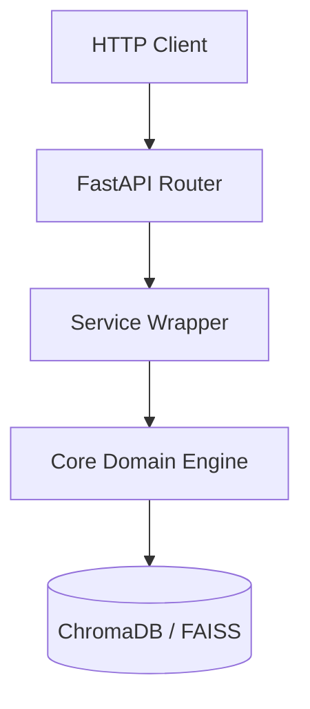
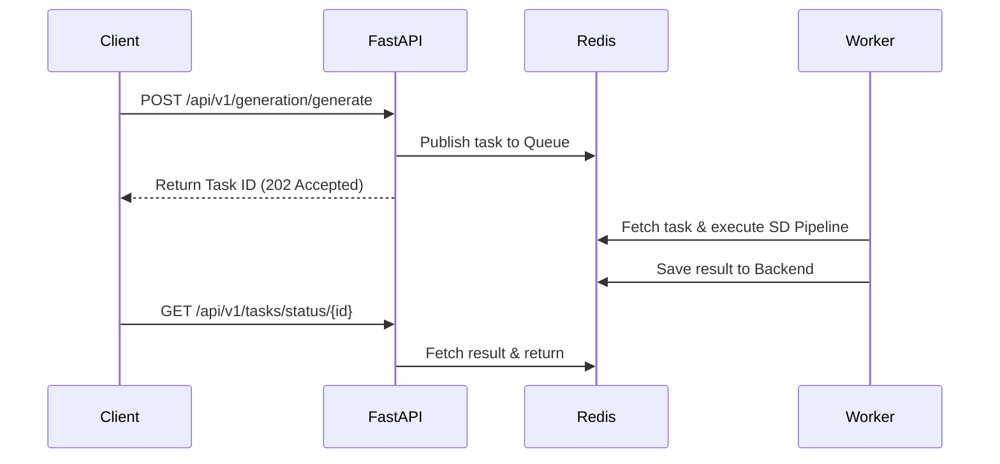

# Week 7 Technical Onboarding Manual: AI Fashion Assistant Backend

This document provides an in-depth reference for the enterprise-grade REST API backend of the AI Fashion Assistant. It covers system architecture, API design, dependency structures, and infrastructure configuration.

---

## 1. FastAPI Architecture

FastAPI acts as the core web frame, orchestrating HTTP routing, validation, error mapping, and service lift-cycles.

### Lifespan Event Loop
FastAPI uses an `asynccontextmanager` called `lifespan` inside [main.py](file:///c:/Users/HP/Desktop/AI%20Fashion%20Agent/fashion-ai-assistant/week7/backend/main.py#L19-L33) to coordinate startup and shutdown cycles:
* **Startup**: Lazily configures logging handlers, verifies environment variables, and pre-warms database connection blocks.
* **Shutdown**: Cleans up locks, flushes log buffers, and closes active server sockets.

### Dependency Injection Pattern
We employ FastAPI's dependency injection system (`Depends()`) to cleanly decouple router endpoints from stateful business services. Singletons are maintained lazily inside [api/dependencies.py](file:///c:/Users/HP/Desktop/AI%20Fashion%20Agent/fashion-ai-assistant/week7/backend/api/dependencies.py):
* Core services (e.g. `GenerationService`, `RAGService`, `RecommendationService`) are resolved dynamically as dependencies.
* During testing, these dependencies are swapped out for deterministic mock providers using `app.dependency_overrides`.

### Middleware Execution Order
HTTP requests pass through a sequence of middlewares in reverse order of registration:
1. **CORS Middleware**: Intercepts origins and registers CORS pre-flight headers.
2. **Centralized Error Handler Middleware**: Intercepts downstream exceptions and maps them to unified JSON responses.
3. **NSFW Middleware Filter**: Scans multipart payload streams for unsafe graphical elements.
4. **Custom Request Logger Middleware**: Tracks metrics, extracts client IPs, and appends latency headers (`X-Process-Time-Ms`).

---

## 2. REST API Design

The backend conforms to RESTful engineering principles and implements API endpoint versioning.

### Endpoint Structure & Versioning
* All stable routes are prefixed with `/api/v1/` to shield client integrators from breaking changes.
* Resources are identified using plural nouns (e.g. `/api/v1/recommendations/styles`, `/api/v1/lora/mix`).

### Schema Validation & Payloads
* Request bodies and query limits are validated at the gateway level using Pydantic schemas defined in the `schemas/` directory.
* Gateway validation isolates the core services from receiving malformed datatypes or out-of-range thresholds.

### Standardized Error Payloads
In the event of a validation or server failure, the application returns a standardized payload format:
```json
{
  "success": false,
  "error": {
    "code": "VALIDATION_ERROR",
    "message": "The request body failed structural validation.",
    "details": [{"loc": ["body", "prompt"], "msg": "field required", "type": "value_error.missing"}]
  }
}
```

---

## 3. Service Layer

The service layer implements the *Separation of Concerns* pattern, segregating FastAPI routing controllers from underlying machine learning models and dataset loaders.



### Core Services:
1. **GenerationService**: Manages style preset injections and triggers stable diffusion image generation pipelines.
2. **ControlNetService**: Preprocesses design templates (Canny edge extraction) and handles layout-conditioned image rendering.
3. **LoraService**: Manages the styling of designs by injecting single or blended brand adapter weights (e.g., Nike, Gucci).
4. **RAGService**: Combines vector retrieval (ChromaDB) and keyword matching (BM25) to run intent-routed assistant chat.
5. **RecommendationService**: Computes personalization rankings over brand catalog profiles and styling items.
6. **HistoryService**: Tracks generated image keys, prompt configurations, and session parameters.
7. **TaskTracker**: Coordinates communication with Redis to poll status states of Celery workers.

---

## 4. Redis Architecture

Redis serves as a high-speed cache, rate limiter database, and task orchestration broker.

### Data Layout & Schema Keys:
* **Session Cache**: Stored under `session:<session_id>` to record active session metadata.
* **Celery Tasks**: Task tracking structures stored under `tasks:<task_id>`.
* **Rate Limiter States**: Counter buckets stored as hashes with a TTL matching the rate limit window (e.g., 60 seconds).

### Caching Strategy & TTL:
* Temporary image outputs and preprocessed sketches use a strict Time-to-Live (TTL) of 24 hours, automatically evicting stale file paths and freeing storage space.

---

## 5. Celery Workflow

For long-running AI inference cycles, execution is delegated asynchronously to distributed Celery workers.



* **Queue Configuration**: Tasks are routed to a dedicated `inference` queue.
* **Worker Registry**: The worker registers tasks such as `generate_image_task`, `generate_conditioned_task`, and `blend_lora_styles_task`.
* **Result Backend**: Task states (PENDING, STARTED, SUCCESS, FAILURE) and output paths are written back to Redis for polling.

---

## 6. Authentication

We implement a stateless authentication model using JSON Web Tokens (JWT) and OAuth2 Bearer standards.

* **Lifecycle**: Clients exchange user credentials for an Access Token (TTL: 1 hour) and a Refresh Token (TTL: 7 days) at `/auth/token`.
* **Hashing**: Password verification utilizes `passlib` with `bcrypt` rounds to securely hash and store credential blocks.
* **Role-Based Access Control (RBAC)**: Custom JWT scopes (`user`, `designer`, `admin`) are encoded in the token payload. Endpoints verify these scopes before processing requests.

---

## 7. Rate Limiting

To prevent API abuse and ensure fair resource distribution, rate limiting is applied using `slowapi`.

* **Slowapi Integration**: Utilizes a Redis-backed token bucket algorithm.
* **Client Identification**: Limiters identify clients by IP address or JWT authentication header tokens.
* **Route Limits**: High-cost generation routes are limited to `10/minute`, RAG conversational routes to `20/minute`, and health checks are unthrottled.

---

## 8. NSFW Detection

Image safety compliance is enforced before returning any synthesized graphical files.

* **Model**: Uses `Falconsai/nsfw_image_detection` (ViT-based safety classification).
* **Execution Flow**: The NSFW filter intercepts generated images, computing a classification score. If the output probability of unsafe content exceeds the `0.85` threshold, the request is terminated with a `400 Bad Request` safety exception, and the file is deleted.

---

## 9. Watermarking

To maintain brand integrity and prevent copyright disputes, a transparent watermark is embedded on all output images.

* **Design**: The string `"Generated by AI Fashion Assistant"` is rendered in white sans-serif font with a thin black drop-shadow to remain legible on both dark and light backgrounds.
* **Pipeline Integration**: The `WatermarkService` processes output PIL images before they are written to disk or converted to Base64 byte-streams.

---

## 10. Monitoring

A dedicated monitoring subsystem tracks hardware metrics and API performance statistics.

### Key Monitoring Metrics:
* **CPU & Memory**: Tracked via `psutil` to raise alerts when threshold usage exceeds 85%.
* **Queue Length**: Gauged by querying the Redis length (`LLEN`) of the active Celery queues.
* **API Latency**: Recorded dynamically by custom middlewares and logged to the telemetry database.
* **Generation Time**: Stored as a metadata property in the history database records.

---

## 11. Testing

The backend maintains high reliability through a pytest suite comprising 42 unit and integration tests.

### Mocking Techniques:
* **Transformers & Stable Diffusion**: Mocked using decorator mocks (`unittest.mock.patch`) to prevent downloading gigabyte-scale weights during test runs.
* **Database**: Mocked in-memory ChromaDB client fallback and virtual FAISS flat index initializations.

### Execution Command:
```bash
python -m pytest --cov=week7/backend week7/backend/tests/
```

---

## 12. Future Kubernetes Integration

For scaling to thousands of concurrent designers, the system is designed to transition to a Kubernetes cluster.

### Containerization:
* Dockerfiles utilize multi-stage builds. The builder stage installs Python dependencies, while the final runner stage copies the virtual environment, keeping the footprint minimal.

### Pod Deployments & HPA:
* **Deployments**: Split into `web-api` (stateless API pods) and `celery-worker` (inference pods).
* **Horizontal Pod Autoscaling (HPA)**: Scaled dynamically based on CPU utilization and Redis queue length metrics.
* **Health Probes**: Pods expose `/api/v1/health` for liveness and readiness diagnostic probes.

---

## 13. Engineering Challenges

* **Import Circularity**: Solved by utilizing dynamic lazy-loading imports inside dependency singletons.
* **Celery Serialization**: Custom `ServiceResult` wrapper objects were refactored to return plain dicts/lists to prevent JSON serialization errors across task boundaries.

---

## 14. References

* **FastAPI**: [https://fastapi.tiangolo.com](https://fastapi.tiangolo.com)
* **Celery Distributed Tasks**: [https://docs.celeryq.dev](https://docs.celeryq.dev)
* **Slowapi Rate Limiter**: [https://slowapi.readthedocs.io](https://slowapi.readthedocs.io)
* **Pillow Image Processing**: [https://pillow.readthedocs.io](https://pillow.readthedocs.io)
