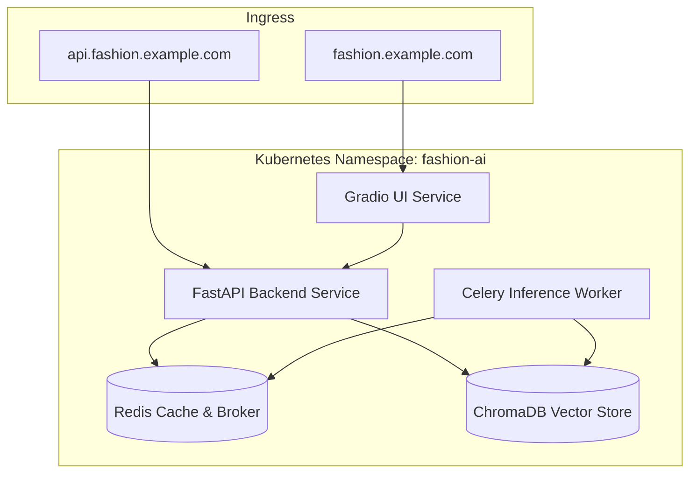
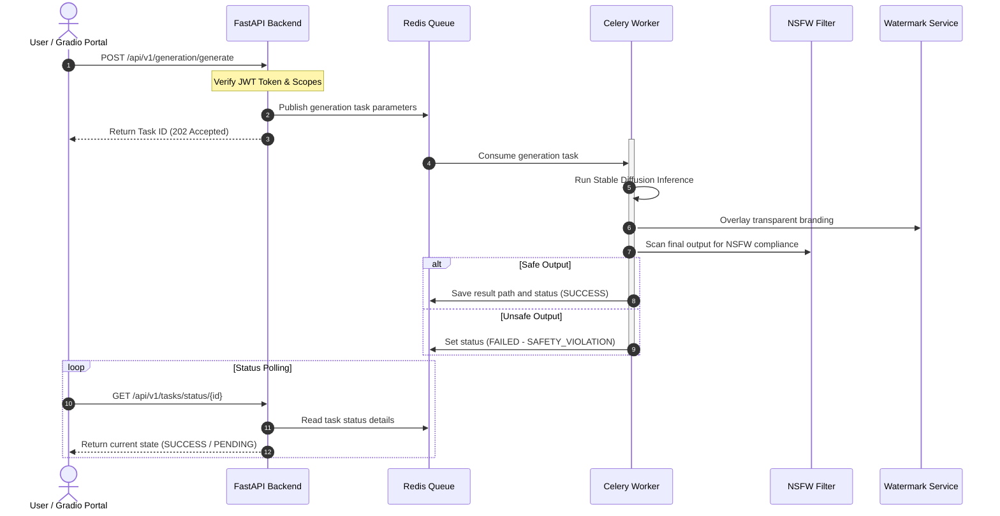

# System Architecture Blueprint

This document details the production-grade deployment layout and operational sequence of the **AI-Powered Fashion Design Assistant** platform.

---

## 1. Deploy Subsystem Layout

* **Gradio UI**: Represents the web front portal where designers interact with text-to-fashion, sketch-to-design, style switcher, and lookbook dashboards.
* **FastAPI REST API**: Serving as the centralized business controller, handling user authorization, RAG chat routing, data history caching, and task queue registration.
* **Redis Broker**: Holds asynchronous Celery task payloads, rate-limit counters, and temporary session keys.
* **Celery Worker**: Hardened single-concurrency worker pod responsible for executing heavy Stable Diffusion / ControlNet layout generation.
* **ChromaDB / FAISS**: Provides vectorized indexes of materials, silhouettes, brand aesthetics, and trend histories.

---

## 2. Asynchronous Generation Sequence

